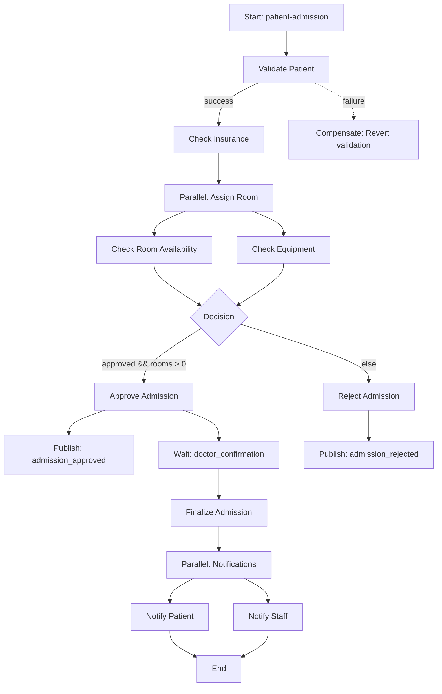

# Patient Admission Workflow Diagram

## Step Details

1. **Validate Patient** - HTTP POST to patient-service
2. **Check Insurance** - HTTP POST to insurance-service  
3. **Parallel Room Assignment**:
   - Check Room Availability (HTTP GET)
   - Check Equipment (HTTP GET)
4. **Decision Switch**:
   - If approved: Approve Admission + Publish success event
   - Else: Reject Admission + Publish rejection event
5. **Event Trigger** - Wait for doctor confirmation
6. **Finalize** - HTTP PUT to finalize admission
7. **Parallel Notifications**:
   - Notify Patient (Kafka)
   - Notify Staff (Kafka)
